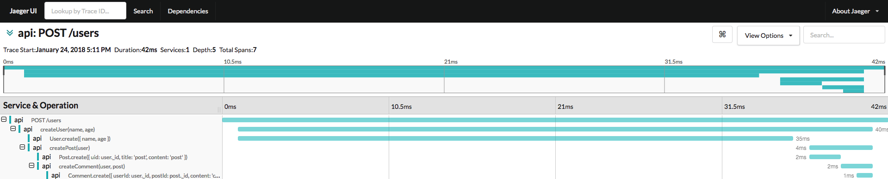

## koa-await-breakpoint-jaeger

> jaeger for [koa-await-breakpoint](https://github.com/nswbmw/koa-await-breakpoint).

**NB**: koa-await-breakpoint-jaeger should used with koa@^2 and koa-router@^7.

### Install

```sh
$ npm i koa-await-breakpoint-jaeger --save
```

### Example

```sh
$ docker run -d -p5775:5775/udp -p6831:6831/udp -p6832:6832/udp -p5778:5778 -p16686:16686 -p14268:14268 jaegertracing/all-in-one:latest
$ docker run -p27017:27017 -d mongo
$ node example/app
$ curl -XPOST localhost:3000/users
```

open jaeger-query default url `http://localhost:16686/search` 

### Usage

```js
new JaegerStore(options)
```

options {Object}:
- reporter: jaeger reporter, default: `new jaeger.RemoteReporter(new UDPSender())`
- sampler: jaeger sampler, default: `new jaeger.ConstSampler(true)`

```js
const path = require('path')
const JaegerStore = require('koa-await-breakpoint-jaeger')
const koaYieldBreakpoint = require('koa-await-breakpoint')({
  name: 'api',
  files: [path.join(__dirname, '**/*.js')],
  store: new JaegerStore()
})

const Koa = require('koa')
const Router = require('koa-router')
const app = new Koa()
const router = new Router()

app.use(koaYieldBreakpoint)

router.post('/users', require('./routes/users').createUser)

app.use(router.routes())
app.use(router.allowedMethods())

app.listen(3000, () => {
  console.log('listening on 3000')
})
```

